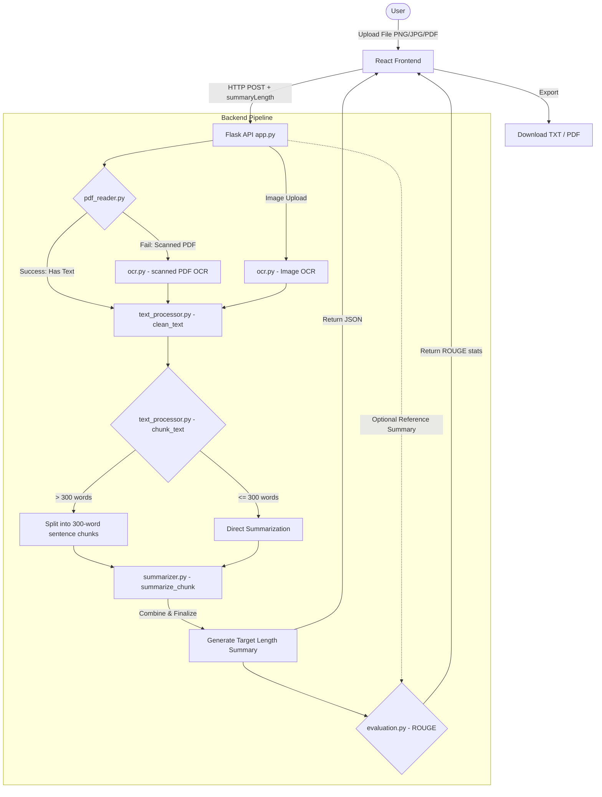

# AI Document Summary Assistant

A powerful, locally-run AI assistant that extracts text from documents (PDFs, JPGs, PNGs) and generates smart abstractive summaries using state-of-the-art Hugging Face models. The application runs entirely offline and includes OCR (for scanned files) and automated ROUGE evaluation.

---

## 📖 Project Overview & Problem Statement

### The Problem
Processing, reading, and synthesizing large volumes of documents (reports, articles, scanned bills) is time-consuming. While commercial cloud APIs (like OpenAI or Gemini) offer summarization and OCR services, they pose **data privacy risks**, require **active internet connections**, and incur **recurring usage fees**.

### The Solution
The **AI Document Summary Assistant** provides a complete, production-grade text processing pipeline that runs **entirely on your local machine**. It uses local OCR engines and a T5 transformer model to deliver high-quality, abstractive summaries without sending data to any third-party servers.

---

## ✨ Features

- **Multi-Format Upload Support**: Accepts digital PDFs, scanned PDFs, JPG, and PNG images.
- **Smart OCR Fallback**: Automatically detects if a PDF contains no digital text (e.g., scanned documents) and triggers local Tesseract OCR to read it.
- **Local T5 Summarizer**: Uses Hugging Face's `t5-small` model running locally to perform abstractive summarization.
- **Target Length Selections**:
  - **Short**: Condenses to ~80 tokens (~50-60 words).
  - **Medium**: Summarizes to ~150 tokens (~100-110 words).
  - **Long**: Retains detail up to ~250 tokens (~170-190 words).
- **Sentence-Aware Chunker**: Prevents model crashes on large documents by segmenting text into sentence-bounded chunks of 300 words and recursively summarizing them.
- **ROUGE Evaluation**: Allows users to enter a reference summary to calculate precision, recall, and F1-scores for ROUGE-1, ROUGE-2, and ROUGE-L.
- **Local PDF/TXT Export**: Download the generated summary and evaluation metrics in PDF or TXT formats instantly.
- **Aesthetic Dashboard**: A modern, glassmorphic dark-mode user interface with responsive elements and upload progress monitoring.

---

## 🏗️ System Architecture & Workflow

The assistant consists of a React client, a Flask API backend, a local OCR system, and a local Hugging Face transformer model.



---

## 🛠️ Installation & Setup

### Prerequisites
Since this application runs entirely locally, it requires a couple of third-party command-line utilities for OCR and page rendering:

#### 1. Install Tesseract OCR (Required for Images and Scanned PDFs)
- **Windows**:
  - Download the Windows installer from [UB Mannheim Tesseract Repository](https://github.com/UB-Mannheim/tesseract/wiki).
  - Run the installer. By default, it installs to `C:\Program Files\Tesseract-OCR\tesseract.exe`.
  - The application is pre-configured to look in this standard path. Alternatively, you can add `C:\Program Files\Tesseract-OCR` to your System Environment variables **Path**.
- **macOS**: `brew install tesseract`
- **Linux**: `sudo apt-get install tesseract-ocr`

#### 2. Install Poppler (Required for Scanned PDFs page-to-image conversion)
- **Windows**:
  - Download the latest Poppler binary package (e.g., from [poppler-windows](https://github.com/oschwartz10612/poppler-windows/releases) or conda-forge).
  - Extract the folder and copy the path to the `bin` directory (e.g., `C:\poppler\Library\bin` or similar).
  - Add this path to your System Environment variables **Path** (under system properties -> environment variables -> path -> edit -> add).
- **macOS**: `brew install poppler`
- **Linux**: `sudo apt-get install poppler-utils`

---

### Backend Setup

1. Navigate to the backend directory:
   ```bash
   cd backend
   ```
2. Activate the virtual environment:
   - **Windows PowerShell**:
     ```powershell
     .\venv\Scripts\Activate.ps1
     ```
   - **macOS/Linux**:
     ```bash
     source venv/bin/activate
     ```
3. Install dependencies:
   ```bash
   pip install -r requirements.txt
   ```
4. Start the Flask server:
   ```bash
   python app.py
   ```
   *Note: On the first startup, the server will download the T5-small model (approx. 242MB) to the `backend/models/t5-small/` folder. This may take a few minutes depending on your internet connection. Subsequent startups will load the model instantly from the disk.*

---

### Frontend Setup

1. Open a new terminal and navigate to the frontend directory:
   ```bash
   cd frontend
   ```
2. Install npm packages:
   ```bash
   npm install
   ```
3. Start the Vite React development server:
   ```bash
   npm run dev
   ```
4. Open the provided local URL in your browser (usually `http://localhost:5173`).

---

# React + Vite

This template provides a minimal setup to get React working in Vite with HMR and some ESLint rules.

Currently, two official plugins are available:

- [@vitejs/plugin-react](https://github.com/vitejs/vite-plugin-react/blob/main/packages/plugin-react) uses [Oxc](https://oxc.rs)
- [@vitejs/plugin-react-swc](https://github.com/vitejs/vite-plugin-react/blob/main/packages/plugin-react-swc) uses [SWC](https://swc.rs/)

## React Compiler

The React Compiler is not enabled on this template because of its impact on dev & build performances. To add it, see [this documentation](https://react.dev/learn/react-compiler/installation).

## Expanding the ESLint configuration

If you are developing a production application, we recommend using TypeScript with type-aware lint rules enabled. Check out the [TS template](https://github.com/vitejs/vite/tree/main/packages/create-vite/template-react-ts) for information on how to integrate TypeScript and [`typescript-eslint`](https://typescript-eslint.io) in your project.

## Deployment

This project is deployed using a split architecture:

- **Frontend (React + Vite)** — deployed on [Vercel](https://vercel.com)
- **Backend (Flask API + OCR + Summarization)** — deployed on [Railway](https://railway.app)

### Frontend — Vercel
The frontend is automatically built and deployed from this repository via Vercel. Any push to the connected branch triggers a redeploy.

Make sure the frontend's environment variable pointing to the backend API URL (e.g. `VITE_API_URL`) is set in your Vercel project settings to match your live Railway backend URL.

### Backend — Railway
The backend is a Python/Flask service deployed on Railway, using Railway's Railpack builder. It handles file uploads, OCR (via Tesseract), and text summarization (via a local Hugging Face T5-small model).

Required system dependencies (Tesseract, Poppler) are installed automatically at build time via the `RAILPACK_DEPLOY_APT_PACKAGES` environment variable set in the Railway service settings.

Live backend URL: `https://docsummaryassistant-production.up.railway.app`

## 🧠 How the AI Model Works

- **T5-Small (Text-to-Text Transfer Transformer)**: Developed by Google, T5 models frame all NLP tasks in a unified text-to-text format. 
- **Task Prefixing**: For summarization, the text input is prepended with the command `"summarize: "`. The model recognizes this prefix and applies weights trained on summarization datasets (like CNN/DailyMail).
- **Local Inference**: The model is executed inside PyTorch (`torch`) locally on your CPU/GPU. No external networks are involved, guaranteeing low latency once cached and absolute privacy.
- **Recursive Summary Generation**: For documents longer than 300 words, the system splits sentences into chunks, summarizes each chunk to condense it, merges the summaries, and performs a final pass to fit the target length constraint (80, 150, or 250 tokens).

---

## 📊 Evaluation Metrics

The evaluation module supports **ROUGE (Recall-Oriented Understudy for Gisting Evaluation)** metrics, which measure the overlap between a generated summary and a human-written reference summary:

- **ROUGE-1**: Evaluates overlap of **unigrams** (single words). Indicates basic content coverage.
- **ROUGE-2**: Evaluates overlap of **bigrams** (two-word sequences). Measures structural fluency and readability.
- **ROUGE-L**: Measures the **Longest Common Subsequence (LCS)**. Accounts for sentence-level structure and word order similarity.

For each metric, we calculate:
1. **Precision**: The proportion of generated summary words that are present in the reference summary.
2. **Recall**: The proportion of reference summary words that are captured in the generated summary.
3. **F1-Score**: The harmonic mean of Precision and Recall, representing the overall accuracy.

---

## 🔮 Future Improvements

1. **GPU Support Auto-Tuning**: Expand pipeline setups to automatically utilize CUDA or Metal (Apple Silicon) if available for faster transformer speeds on giant textbooks.
2. **Key Entity Extraction**: Add a separate local model (e.g., Spacy or BERT NER) to extract names, dates, and core locations.
3. **Multi-lingual OCR & Summarization**: Incorporate multilingual T5 models (like mT5) and Tesseract language packs to support non-English documents.
